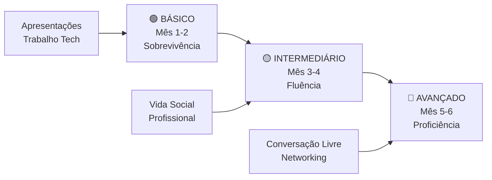

# 🎯 PLANO MESTRE: INGLÊS CONVERSACIONAL EM 6 MESES

**🚀 De Zero à Conversação Fluente**  
**👨‍💻 Especialmente Desenvolvido para Engenheiros de Software**  
**⏰ 30-45 minutos/dia | 📅 180 dias | 🎯 Meta: Conversação Natural**

---

## 📊 VISÃO GERAL DO CURSO

### **🎯 OBJETIVO PRINCIPAL**
Em 6 meses, você será capaz de:
- ✅ Manter conversas naturais de 15+ minutos
- ✅ Apresentar projetos técnicos com confiança
- ✅ Participar de reuniões internacionais
- ✅ Fazer networking efetivo em eventos tech
- ✅ Realizar entrevistas técnicas em inglês
- ✅ Mentorizar/ensinar conceitos técnicos

### **📈 PROGRESSÃO DOS MÓDULOS**



---

## 🗓️ CRONOGRAMA DETALHADO

### **🟢 MÓDULO BÁSICO (Mês 1-2): FUNDAMENTOS**

#### **📅 MÊS 1: SOBREVIVÊNCIA CONVERSACIONAL**
**Tempo:** 30 min/dia | **Meta:** Small talk básico + apresentação pessoal

| Semana | Foco | Conteúdo | Marco |
|--------|------|----------|-------|
| **S1** | Apresentações | Cumprimentos, nome, nacionalidade, profissão | Apresentação de 2 min |
| **S2** | Perguntas Essenciais | What/Where/How questions + respostas | Fazer 10 perguntas fluentemente |
| **S3** | Rotina e Números | Horários, idades, quantidades, rotina diária | Descrever seu dia |
| **S4** | **AVALIAÇÃO** | Integração + teste | **Conversa de 3 minutos** |

**📁 Arquivos:** `modulo-basico/mes-01-sobrevivencia/`

#### **📅 MÊS 2: TRABALHO E TECNOLOGIA**
**Tempo:** 35 min/dia | **Meta:** Falar sobre trabalho com confiança

| Semana | Foco | Conteúdo | Marco |
|--------|------|----------|-------|
| **S1** | Vocabulário Tech | Linguagens, frameworks, ferramentas | Apresentação profissional |
| **S2** | Present Tense | Simple/Continuous para trabalho | Rotina profissional |
| **S3** | Habilidades | Can/can't, experience, skills | Lista de competências |
| **S4** | **AVALIAÇÃO** | Elevator pitch | **90 segundos técnicos** |

**📁 Arquivos:** `modulo-basico/mes-02-trabalho-tech/`

---

### **🟡 MÓDULO INTERMEDIÁRIO (Mês 3-4): FLUÊNCIA**

#### **📅 MÊS 3: VIDA SOCIAL E OPINIÕES**
**Tempo:** 40 min/dia | **Meta:** Conversação social natural

| Semana | Foco | Conteúdo | Marco |
|--------|------|----------|-------|
| **S1** | Hobbies/Interesses | Lazer, preferências, atividades | Falar sobre gostos |
| **S2** | Past Simple | Experiências, viagens, projetos antigos | Contar histórias |
| **S3** | Opiniões | Think/believe, agree/disagree | Debate simples |
| **S4** | **AVALIAÇÃO** | Conversa social | **5 minutos fluentes** |

**📁 Arquivos:** `modulo-intermediario/mes-03-vida-social/`

#### **📅 MÊS 4: FLUÊNCIA PROFISSIONAL**
**Tempo:** 40 min/dia | **Meta:** Contextos profissionais avançados

| Semana | Foco | Conteúdo | Marco |
|--------|------|----------|-------|
| **S1** | Conectores | Linking words, transições, fluência | Fala sem hesitação |
| **S2** | Reuniões | Meeting vocabulary, apresentações | Participar de meetings |
| **S3** | Problem-solving | Explicar problemas/soluções técnicas | Troubleshooting em inglês |
| **S4** | **AVALIAÇÃO** | Entrevista técnica | **Q&A de 7 minutos** |

**📁 Arquivos:** `modulo-intermediario/mes-04-fluencia-profissional/`

---

### **🔴 MÓDULO AVANÇADO (Mês 5-6): PROFICIÊNCIA**

#### **📅 MÊS 5: CONVERSAÇÃO AVANÇADA**
**Tempo:** 45 min/dia | **Meta:** Nuances e naturalidade

| Semana | Foco | Conteúdo | Marco |
|--------|------|----------|-------|
| **S1** | Idioms/Expressions | Linguagem nativa, expressões comuns | Falar como nativo |
| **S2** | Debates Técnicos | Argumentação, contra-argumentos | Defender pontos de vista |
| **S3** | Networking | Small talk avançado, cultural awareness | Conexões internacionais |
| **S4** | **AVALIAÇÃO** | Tópicos complexos | **10 minutos espontâneos** |

**📁 Arquivos:** `modulo-avancado/mes-05-conversacao-avancada/`

#### **📅 MÊS 6: PROFICIÊNCIA COMPLETA**
**Tempo:** 45 min/dia | **Meta:** Domínio conversacional total

| Semana | Foco | Conteúdo | Marco |
|--------|------|----------|-------|
| **S1** | Public Speaking | Apresentações formais, confiança | Apresentação de 5 min |
| **S2** | Negociações | Business English, reuniões internacionais | Simular negociação |
| **S3** | Mentoring | Ensinar/explicar conceitos em inglês | Aula de 10 min |
| **S4** | **TESTE FINAL** | Conversação livre total | **15+ minutos naturais** |

**📁 Arquivos:** `modulo-avancado/mes-06-proficiencia-completa/`

---

## 📁 ESTRUTURA COMPLETA DOS ARQUIVOS

```
📂 ingles-6-meses/
├── 📄 PLANO-MESTRE-6-MESES.md ← VOCÊ ESTÁ AQUI
├── 📄 GUIA-DE-INICIO-RAPIDO.md
├── 📄 progresso-mensal.md
│
├── 📂 modulo-basico/
│   ├── 📂 mes-01-sobrevivencia/
│   │   ├── semana-01-apresentacoes.md
│   │   ├── semana-02-perguntas-essenciais.md
│   │   ├── semana-03-rotina-numeros.md
│   │   ├── semana-04-avaliacao-mes1.md
│   │   └── exercicios-diarios-mes1.md
│   │
│   ├── 📂 mes-02-trabalho-tech/
│   │   ├── semana-01-vocabulario-tech.md
│   │   ├── semana-02-present-tense-trabalho.md
│   │   ├── semana-03-habilidades-experiencia.md
│   │   ├── semana-04-avaliacao-mes2.md
│   │   └── exercicios-diarios-mes2.md
│   │
│   └── 📄 resumo-modulo-basico.md
│
├── 📂 modulo-intermediario/
│   ├── 📂 mes-03-vida-social/
│   ├── 📂 mes-04-fluencia-profissional/
│   └── 📄 resumo-modulo-intermediario.md
│
├── 📂 modulo-avancado/
│   ├── 📂 mes-05-conversacao-avancada/
│   ├── 📂 mes-06-proficiencia-completa/
│   └── 📄 resumo-modulo-avancado.md
│
├── 📂 recursos-complementares/
│   ├── 📄 vocabulario-tech-completo.md
│   ├── 📄 templates-conversacao.md
│   ├── 📄 guia-pronuncia.md
│   ├── 📄 recursos-externos.md
│   └── 📄 dicas-estudo-acelerado.md
│
├── 📂 avaliacoes/
│   ├── 📂 testes-mensais/
│   ├── 📂 marcos-de-progresso/
│   ├── 📄 autoavaliacao-semanal.md
│   └── 📄 certificado-conclusao.md
│
└── 📂 material-original/
    └── [arquivos atuais migrados para referência]
```

---

## ⚡ METODOLOGIA DE ESTUDO

### **📚 ESTRUTURA DIÁRIA PADRÃO**

#### **Mês 1-2 (30-35 minutos):**
- **5 min:** Revisão rápida (vocabulário anterior)
- **15 min:** Novo conteúdo + explicação
- **8 min:** Speaking practice (gravação obrigatória)
- **7 min:** Listening/vídeos

#### **Mês 3-4 (40 minutos):**
- **5 min:** Warm-up (falar sobre o dia)
- **20 min:** Novo conteúdo + prática
- **10 min:** Conversação/role-play
- **5 min:** Recursos externos

#### **Mês 5-6 (45 minutos):**
- **5 min:** Think in English (preparação mental)
- **25 min:** Conteúdo avançado + debates
- **10 min:** Conversação livre
- **5 min:** Análise de progresso

### **🎯 PRINCÍPIOS PEDAGÓGICOS**

1. **Input Compreensível** (i+1): 70% conhecido + 30% desafio
2. **Output Ativo**: Falar desde o primeiro dia
3. **Spaced Repetition**: Revisão espaçada científica
4. **Contextualização**: Palavras sempre em situações reais
5. **Imersão Gradual**: Complexidade progressiva controlada

---

## 📊 SISTEMA DE AVALIAÇÃO

### **🏆 MARCOS MENSAIS**

| Mês | Marco Principal | Tempo | Critério de Sucesso |
|-----|----------------|-------|-------------------|
| **1** | Apresentação pessoal completa | 3 min | Fluente sem travadas longas |
| **2** | Elevator pitch técnico | 90 seg | Apresentação profissional clara |
| **3** | Conversa social | 5 min | Troca natural de perguntas/respostas |
| **4** | Entrevista técnica simulada | 7 min | Responder Q&A técnico |
| **5** | Debate/discussão | 10 min | Argumentar pontos de vista |
| **6** | **Conversação livre** | **15+ min** | **Naturalidade total** |

### **📈 TRACKING SEMANAL**

**Avalie-se semanalmente (1-10):**
- **Fluência**: Velocidade e naturalidade
- **Vocabulário**: Variedade de palavras
- **Gramática**: Correção estrutural  
- **Confiança**: Segurança ao falar
- **Compreensão**: Entendimento do outro

### **🎯 CONQUISTAS ESPECIAIS**

- 🥇 **Primeira semana sem travar**
- 🥇 **Primeira conversa de 5 min completa**
- 🥇 **Primeiro debate técnico**
- 🥇 **Primeira apresentação formal**
- 🥇 **Primeira conversa com nativo**
- 🥇 **🏆 CONVERSAÇÃO MÁSTER (15+ min naturais)**

---

## 🚀 RECURSOS INTEGRADOS

### **📱 Apps Recomendados por Módulo**

**Básico:**
- **HelloTalk** - Conversação com nativos
- **Anki** - Flashcards inteligentes
- **Forvo** - Pronúncia correta

**Intermediário:**
- **Cambly** - Aulas 1:1 (2x/semana)
- **Speechling** - Análise de pronúncia
- **BBC Learning English** - Listening

**Avançado:**
- **Preply** - Tutores especializados
- **TED Talks** - Apresentações avançadas
- **LinkedIn Learning** - Cursos em inglês

### **🎥 Canais YouTube Progressivos**

**Mês 1-2:** EnglishClass101, Rachel's English
**Mês 3-4:** Speak English with Vanessa, Business English Pod
**Mês 5-6:** TED-Ed, Traversy Media (tutoriais técnicos)

---

## 💡 DICAS DE SUCESSO

### **✅ FAÇA:**
- **Grave-se TODOS os dias** (essencial para progresso)
- **Pense em inglês** durante atividades rotineiras
- **Use shadowing** com vídeos técnicos
- **Celebre pequenas vitórias** semanalmente
- **Conecte-se com outros devs** aprendendo inglês

### **❌ EVITE:**
- **Tradução mental** constante
- **Busca pela perfeição** gramatical
- **Pular exercícios de speaking**
- **Estudar apenas gramática**
- **Desistir nos primeiros obstáculos**

---

## 📞 SUPORTE E COMUNIDADE

### **🤝 Encontre Parceiros de Prática:**
- **Discord**: Servidores de dev brasileiro
- **Telegram**: Grupos de inglês para programadores
- **Reddit**: r/Portuguese + r/LearnEnglish
- **LinkedIn**: Grupos de tech em inglês

### **🆘 Se Você Travar:**
1. **Respire fundo** - nervosismo é normal
2. **Fale mais devagar** - clareza > velocidade  
3. **Use paráfrases** - explique diferente se não souber palavra
4. **Volte ao básico** - retome exercícios mais simples
5. **Procure ajuda** - use os recursos da comunidade

---

## 🎯 PRÓXIMOS PASSOS

### **🚀 PARA COMEÇAR HOJE:**

1. **Leia** o `GUIA-DE-INICIO-RAPIDO.md`
2. **Configure** seu ambiente de estudo
3. **Baixe** os apps essenciais  
4. **Faça** seu primeiro exercício (15 min)
5. **Registre** no `progresso-mensal.md`

### **📅 CRONOGRAMA PESSOAL:**

**Data de início:** ___/___/2024  
**Meta de conclusão:** ___/___/2024  
**Horário de estudo:** _______ às _______  
**Local de estudo:** _________________________  

---

## 💪 MENSAGEM MOTIVACIONAL FINAL

> **"Success is not final, failure is not fatal: it is the courage to continue that counts."** - Winston Churchill

**Você está prestes a embarcar em uma jornada transformadora!** 

Em 6 meses, você não será apenas um desenvolvedor que sabe inglês - você será um **profissional global** capaz de:
- Trabalhar em empresas internacionais
- Contribuir para projetos open source mundiais  
- Participar de conferências técnicas globais
- Mentorizar desenvolvedores de outros países
- Expandir sua carreira sem fronteiras

**🎯 Lembre-se:**
- Cada minuto de prática te aproxima da fluência
- Erros são features, não bugs do seu aprendizado
- Você já tem a disciplina (é desenvolvedor!)
- A consistência vai te levar ao objetivo

---

**🚀 READY TO CODE IN ENGLISH? LET'S GO! 💻🇺🇸**

---

*Último update: Janeiro 2024*  
*Próxima revisão: Após conclusão do primeiro grupo de estudantes* 